# Demo photographs

Ten inputs in fixed order: six user-provided files and four reused reference cases. Example 04 repeats the staggered-console reference. The user-provided set is not six independent unseen cases. No gold labels or accuracy scores are supplied for these inputs.

The photographs remain third-party material. Sources and authors are not verified for all ten. Publication was requested by the owner; this is not a legal warranty or a public license. The photographs are excluded from Apache-2.0 and CC BY 4.0 grants.

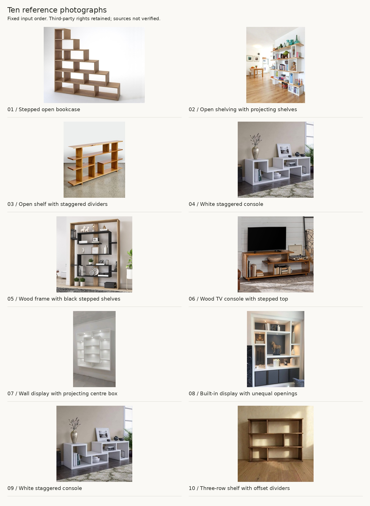

## 01 / Stepped open bookcase

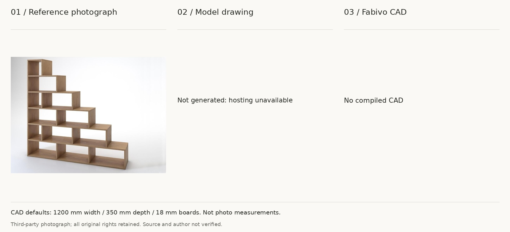

Not generated: Hugging Face denied ZeroGPU hosting (HTTP 402). No GPU call was made and no result was substituted. This is a hosting limit, not a measured model failure.

## 02 / Open shelving with projecting shelves

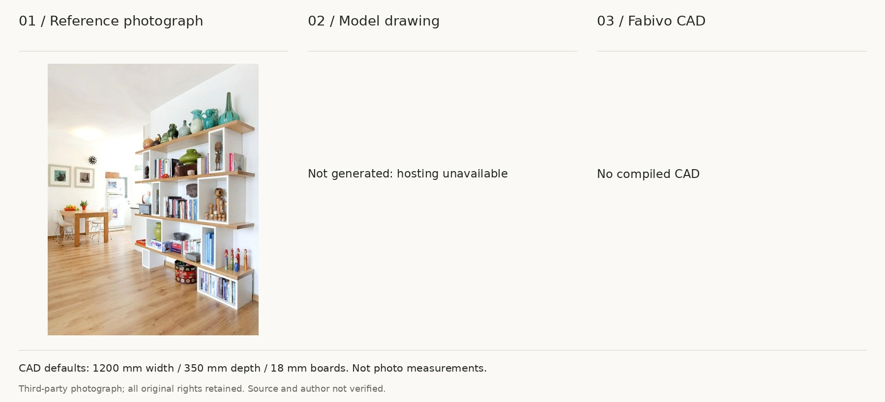

Not generated: Hugging Face denied ZeroGPU hosting (HTTP 402). No GPU call was made and no result was substituted. This is a hosting limit, not a measured model failure.

## 03 / Open shelf with staggered dividers

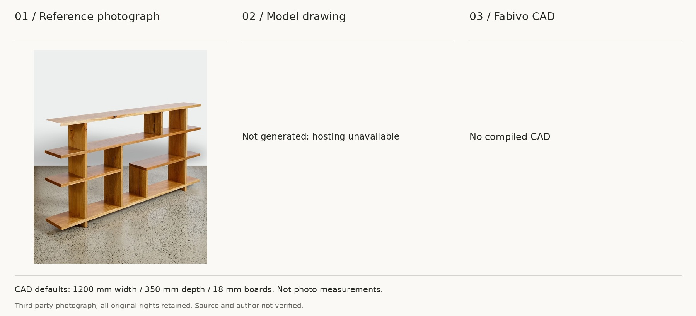

Not generated: Hugging Face denied ZeroGPU hosting (HTTP 402). No GPU call was made and no result was substituted. This is a hosting limit, not a measured model failure.

## 04 / White staggered console

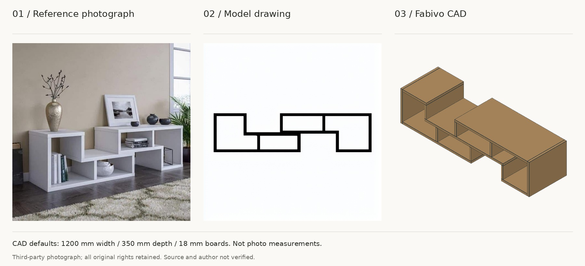

Not generated: Hugging Face denied ZeroGPU hosting (HTTP 402). No GPU call was made and no result was substituted. This is a hosting limit, not a measured model failure.

## 05 / Wood frame with black stepped shelves

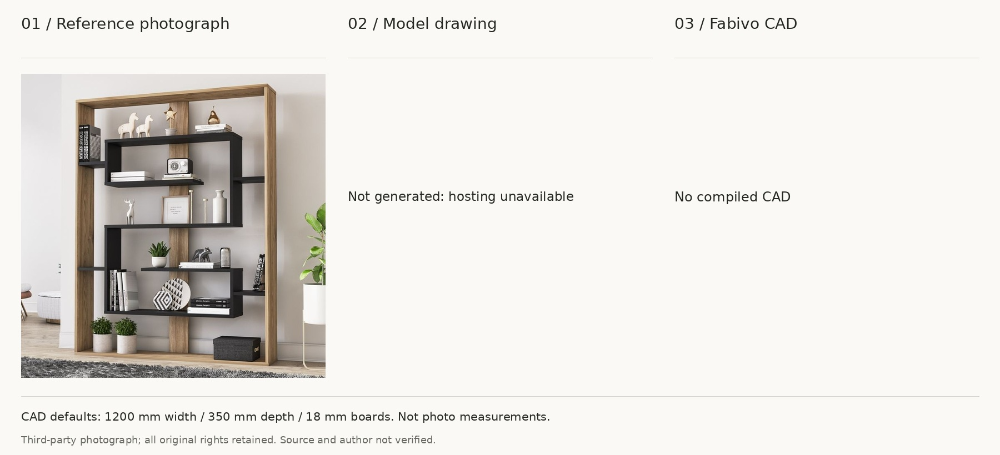

Not generated: Hugging Face denied ZeroGPU hosting (HTTP 402). No GPU call was made and no result was substituted. This is a hosting limit, not a measured model failure.

## 06 / Wood TV console with stepped top

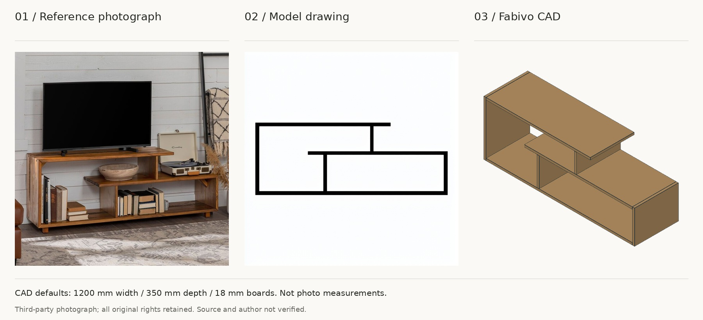

Not generated: Hugging Face denied ZeroGPU hosting (HTTP 402). No GPU call was made and no result was substituted. This is a hosting limit, not a measured model failure.

## 07 / Wall display with projecting centre box

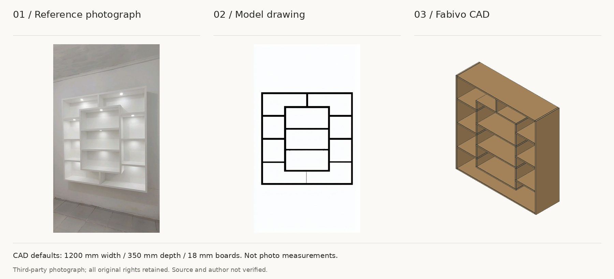

m11 / Turbo10 / seed 0. Actual cached drawing and compiled Fabivo panels; no corrected geometry.

## 08 / Built-in display with unequal openings

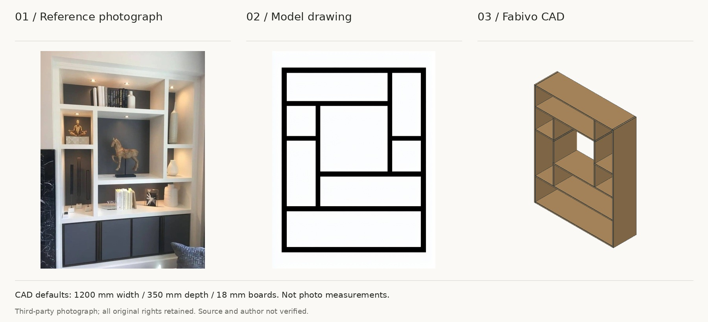

m11 / Turbo10 / seed 0. Actual cached drawing and compiled Fabivo panels; no corrected geometry.

## 09 / White staggered console

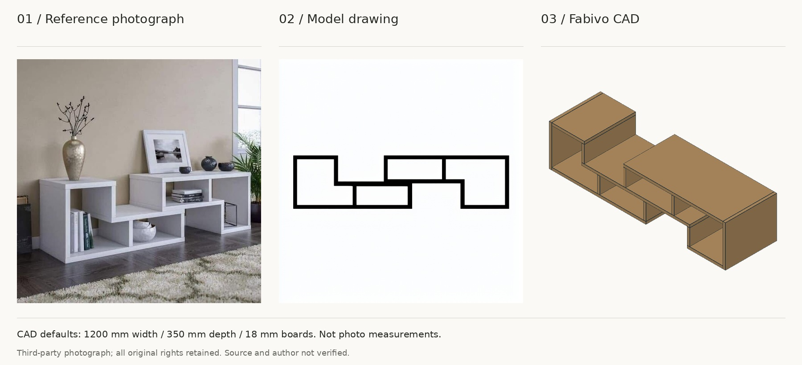

m11 / Turbo10 / seed 0. Actual cached drawing and compiled Fabivo panels; no corrected geometry.

## 10 / Three-row shelf with offset dividers

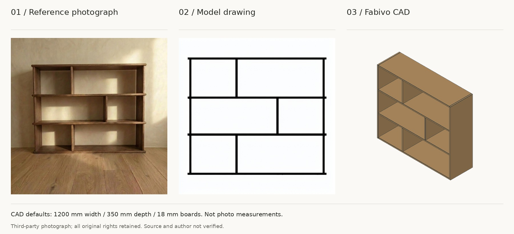

m11 / Turbo10 / seed 0. Actual cached drawing and compiled Fabivo panels; no corrected geometry.

The reader uses assigned defaults of 1200 mm width, 350 mm depth and 18 mm boards. These are not calibrated measurements. Hidden construction and build safety are not established.

## Rebuild

Run `python3 scripts/build_demo_examples.py --manifest PRIVATE_MANIFEST`. Add `--generated GENERATED_MANIFEST` only after actual drawings and Fabivo renders are ready. The script does not call a model or create CAD geometry. The private manifests must not be published.
