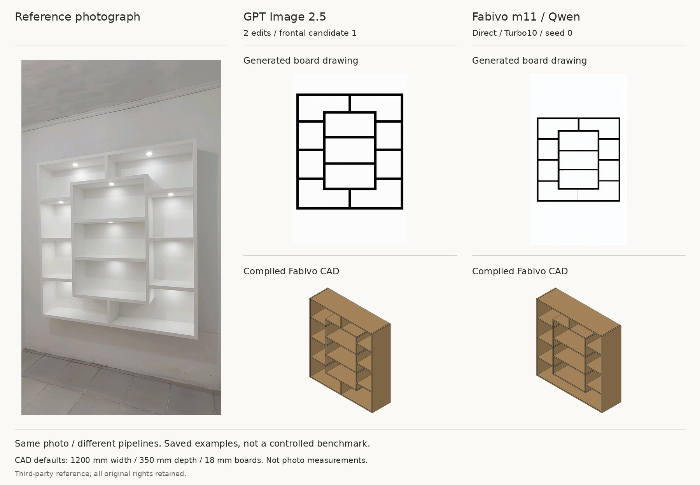
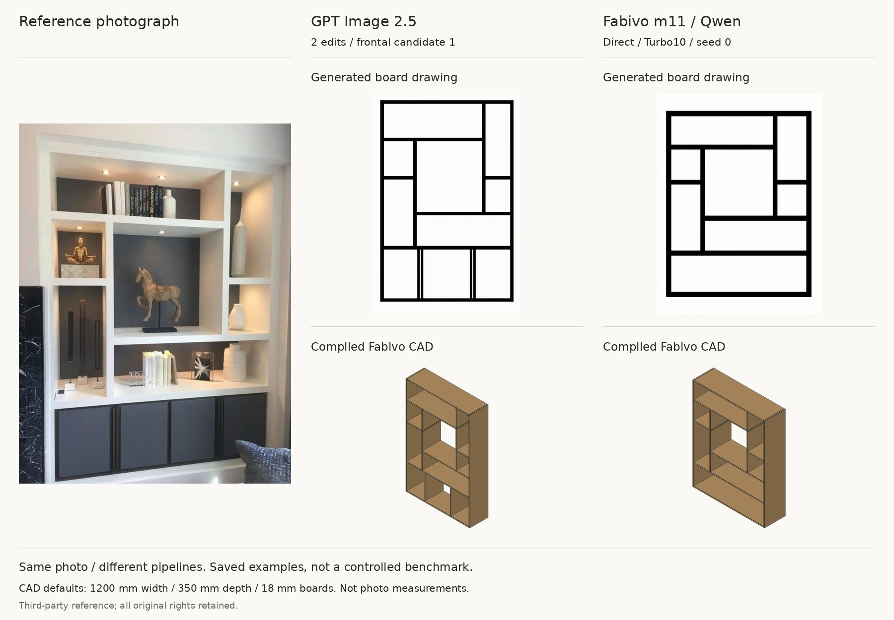
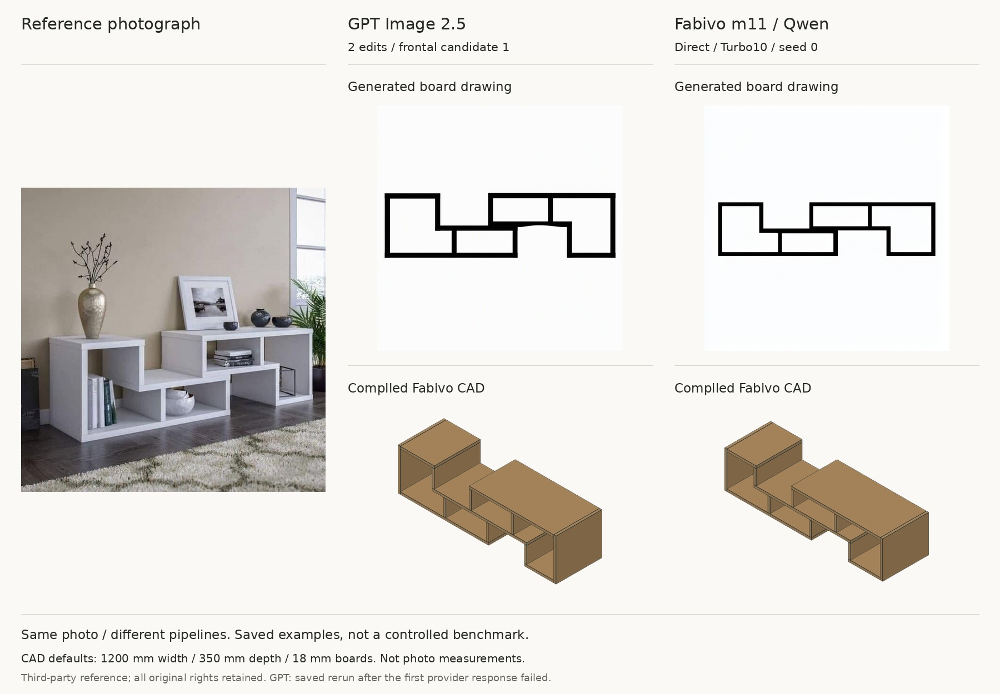

# GPT Image 2.5 and Fabivo m11: saved visual examples

The same source photographs enter two different pipelines. GPT Image 2.5 uses a frontal edit, then a board-drawing edit. Fabivo m11 predicts the drawing directly. The same current Fabivo reader compiles both drawings into panels. No boards were manually repaired.

**These are three illustrative archived cases, not a controlled benchmark or proof of general superiority.** Prompts, resolution, inference budget and execution hardware differ. The GPT run uses Azure `gpt-image-2.5-sunburst`, low quality, prompt version `two-step-v5`, frontal candidate 1. m11 uses the published rank64 3000-EMA adapter, Turbo10, 768 pixels and seed 0. No four-seed selection is used in these figures.

The cases are three requested references with saved outputs on both sides. They are not a complete GPT evaluation set or new unseen tests. The first GPT attempt on the staggered console failed with `invalid-provider-response`; the figure explicitly uses its saved rerun, not the failed call. No best-of selection was made between successful candidates.

Width 1200 mm, depth 350 mm, thickness 18 mm and finish are assigned defaults for both CAD renders, not measurements recovered from the photo. Hidden construction and build safety are not established. Third-party reference photos retain all original rights and are excluded from software and dataset licenses.

## Wall display with projecting centre box

GPT uses candidate 1 of the saved production run.

## Built-in display with unequal openings

GPT uses candidate 1 of the saved production run.

## White staggered console

GPT uses the saved rerun after an invalid provider response.

## Rebuild

`python3 scripts/build_gpt_comparison.py --manifest PRIVATE_MANIFEST --bridge AUTHORIZED_FABIVO_BRIDGE`

The script checks the saved GPT model metadata and compiles its real drawing. It needs Pillow and the authorized Fabivo CPU bridge. It does not call an image API, load gold geometry, or perform GPU inference. Public hashes identify the exact archived artifacts; local input paths are not published.
