# Photo-to-CAD gallery

17 visual examples are shown. Two cases were removed from the example gallery at the owner's request. The benchmark and full score table still include all 19 cases; no scores were removed or recomputed.

Experimental m11 rank64 3000-EMA, Turbo10, resolution768, seeds0–3. The medoid picks one drawing by agreement among valid candidates, without gold labels. This is a reused gold diagnostic, not a test-selected production policy.

[Open the static HTML case page](cases.html) locally for larger comparisons. Each figure shows the original third-party reference, the ACTUAL selected model drawing and the archived compiled document rendered by Fabivo. No geometry was corrected for presentation. Width1200 mm, depth350 mm and thickness18 mm are illustrative defaults, not photo measurements; the neutral finish is a display override.

References retain third-party rights and are not CC BY or Apache assets. [Sources and missing credits](comparison-sources.md). [Renderer and asset provenance](figure-provenance.md).

## 01 / boxed-centre-photo

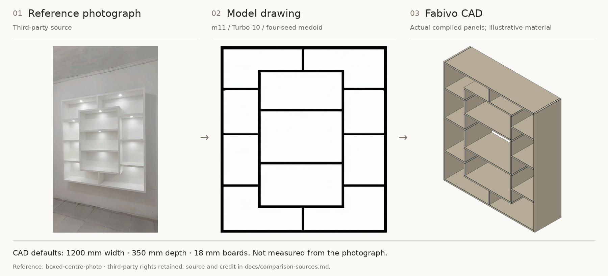

## 02 / photo-asymmetric-bookcase

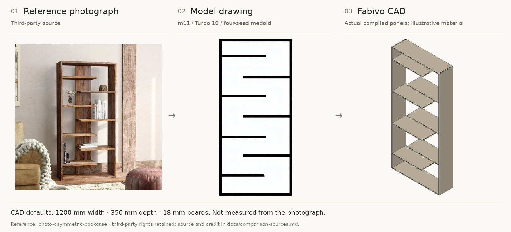

## 03 / photo-bookcase-run

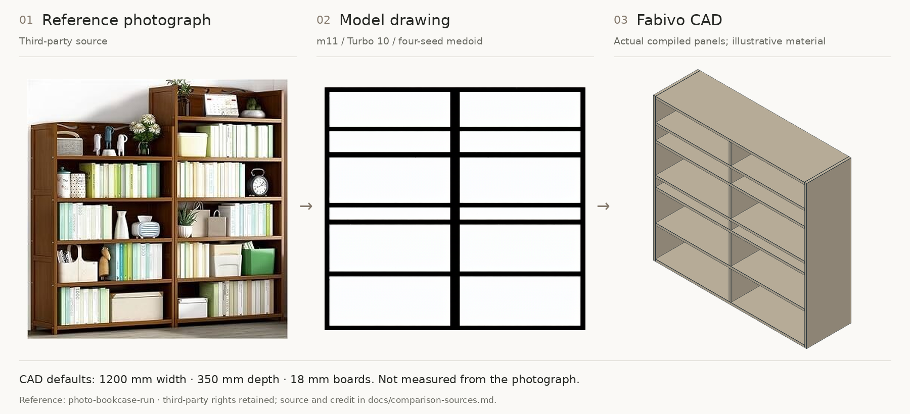

## 04 / photo-built-in-display

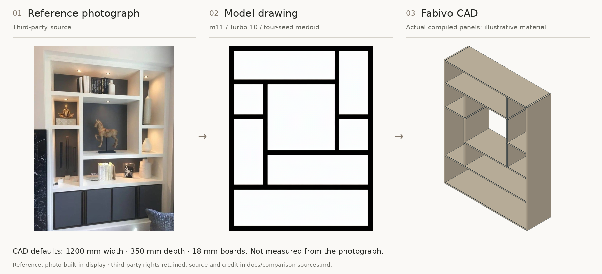

## 05 / photo-staggered-console

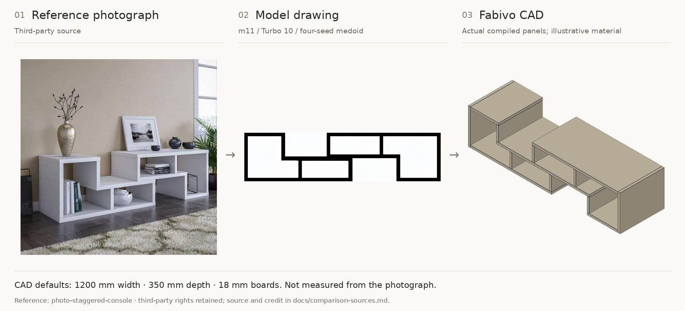

## 06 / photo-wall-niche-grid

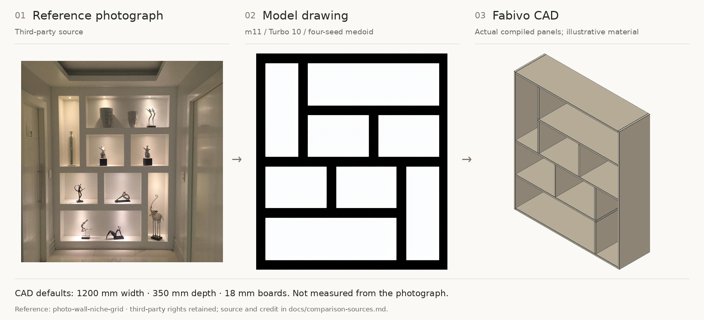

## 07 / real-closed011

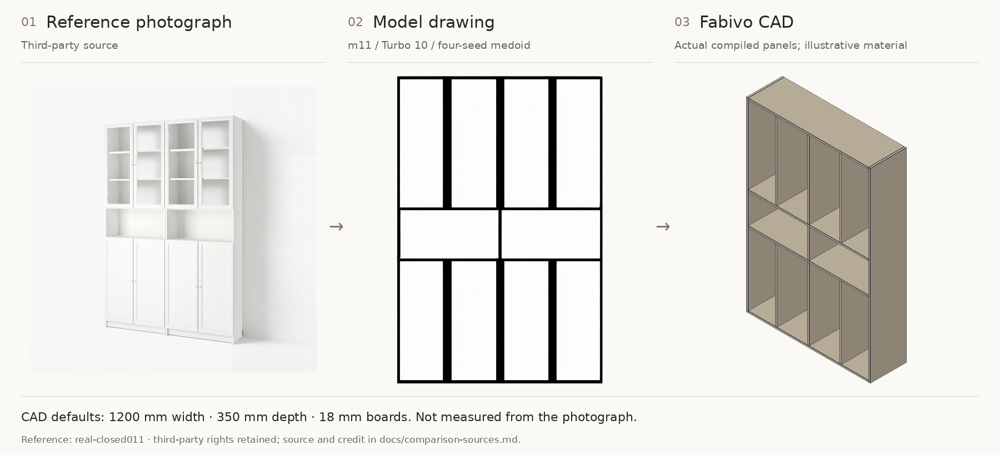

## 08 / real-closed021

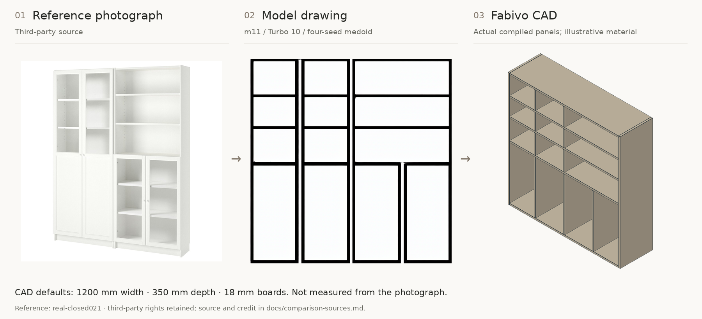

## 09 / real-console003

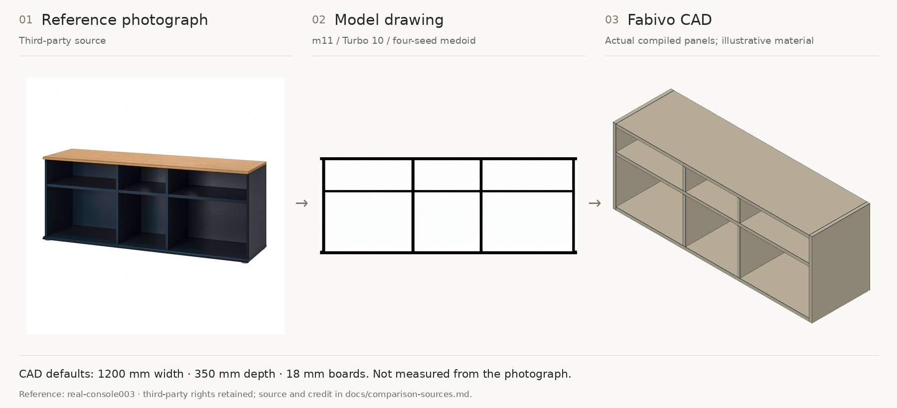

## 10 / real-console004

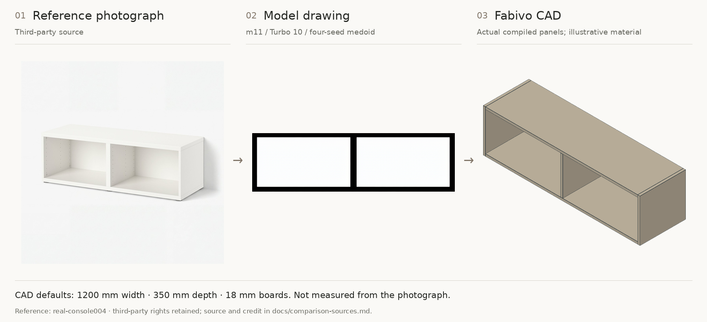

## 11 / real-console008

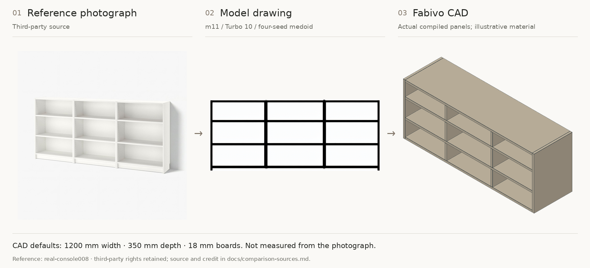

## 12 / real-console021

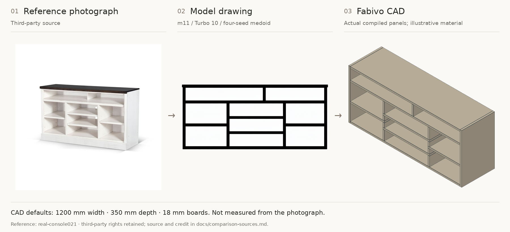

## 15 / real-console039

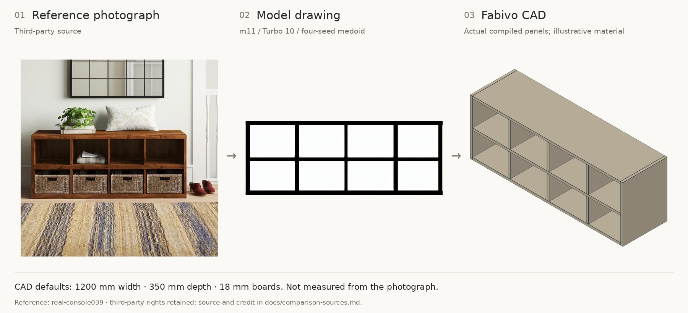

## 16 / real-console043

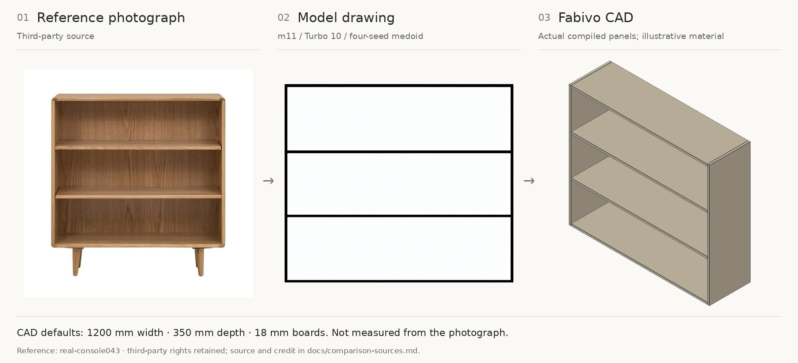

## 17 / real-open024

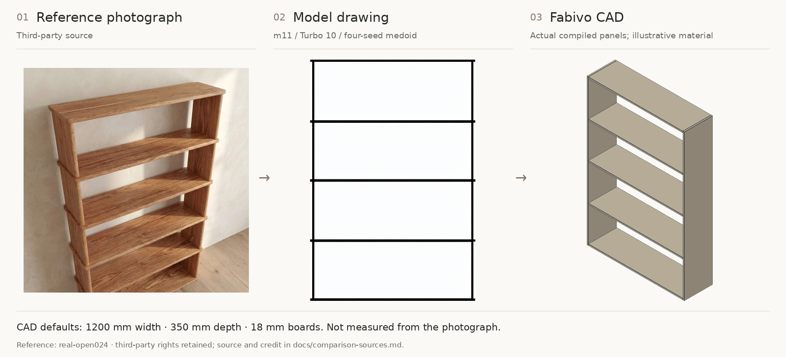

## 18 / real-open041

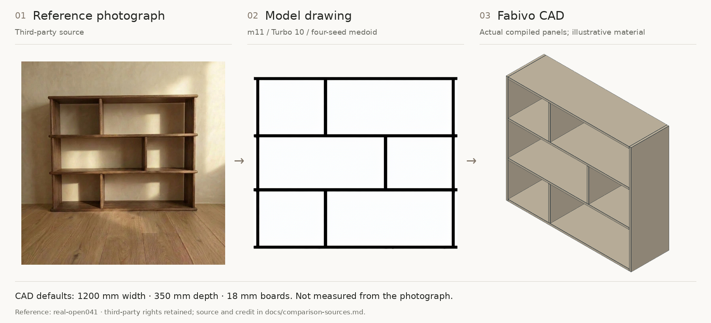

## 19 / real-open056

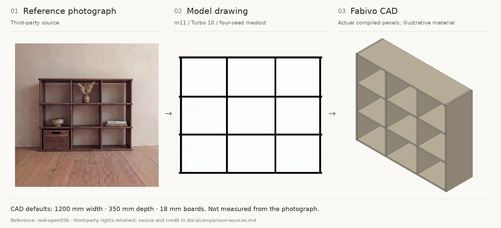

## All-case scores

Structural / board F1. Main means include all 19 cases and failures. Full precision and seed-0 standard/Turbo scores are in [the verified JSON](../results/m11-verified.json).

| Case | Turbo6 medoid | Turbo10 medoid | Turbo15 medoid | Standard28 seed0 |
|---|---:|---:|---:|---:|
| boxed-centre-photo | 1.0000 / 0.0870 | 1.0000 / 0.0435 | 1.0000 / 0.0435 | 1.0000 / 0.0000 |
| photo-asymmetric-bookcase | 1.0000 / 0.3636 | 1.0000 / 0.3636 | 1.0000 / 0.4545 | 1.0000 / 0.4545 |
| photo-bookcase-run | 0.8000 / 0.0000 | 0.8000 / 0.0000 | 0.7368 / 0.0000 | 0.6667 / 0.0000 |
| photo-built-in-display | 1.0000 / 0.0769 | 1.0000 / 0.0769 | 1.0000 / 0.0769 | 1.0000 / 0.0769 |
| photo-staggered-console | 0.8889 / 0.0000 | 0.8889 / 0.0000 | 0.8889 / 0.0000 | 0.8889 / 0.0000 |
| photo-wall-niche-grid | 1.0000 / 0.0833 | 1.0000 / 0.0833 | 1.0000 / 0.0833 | 1.0000 / 0.0769 |
| real-closed011 | 0.7000 / 0.0909 | 0.7000 / 0.0909 | 0.7000 / 0.0909 | 0.0000 / 0.0000 |
| real-closed021 | 0.5263 / 0.0870 | 0.8000 / 0.0769 | 0.8000 / 0.0769 | 0.5263 / 0.0870 |
| real-console003 | 1.0000 / 0.5000 | 1.0000 / 0.5000 | 1.0000 / 0.5000 | 1.0000 / 0.5000 |
| real-console004 | 1.0000 / 0.2000 | 1.0000 / 0.8000 | 1.0000 / 0.4000 | 1.0000 / 0.8000 |
| real-console008 | 1.0000 / 0.3000 | 1.0000 / 0.3000 | 1.0000 / 0.3000 | 0.9333 / 0.1176 |
| real-console021 | 1.0000 / 0.2000 | 1.0000 / 0.1333 | 1.0000 / 0.1333 | 1.0000 / 0.1333 |
| real-console028 | 0.8571 / 0.8571 | 0.8571 / 0.0000 | 0.8571 / 0.0000 | 0.5333 / 0.1333 |
| real-console032 | 0.8000 / 0.2000 | 0.8000 / 0.8000 | 0.8000 / 0.8000 | 0.9231 / 0.2667 |
| real-console039 | 1.0000 / 0.5263 | 1.0000 / 0.1053 | 1.0000 / 0.1053 | 1.0000 / 0.2105 |
| real-console043 | 1.0000 / 0.8333 | 1.0000 / 1.0000 | 1.0000 / 1.0000 | 1.0000 / 0.8333 |
| real-open024 | 0.9333 / 0.0000 | 1.0000 / 0.0000 | 1.0000 / 0.0000 | 0.0000 / 0.0000 |
| real-open041 | 1.0000 / 0.2222 | 1.0000 / 0.2222 | 1.0000 / 0.2222 | 1.0000 / 0.2222 |
| real-open056 | 1.0000 / 0.3000 | 1.0000 / 0.2000 | 1.0000 / 0.2000 | 1.0000 / 0.2000 |
