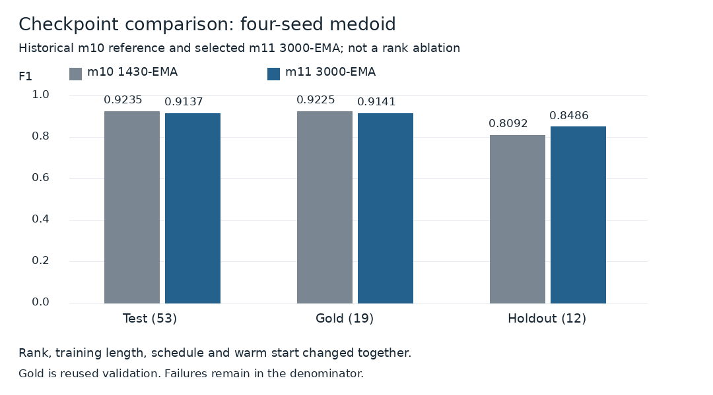
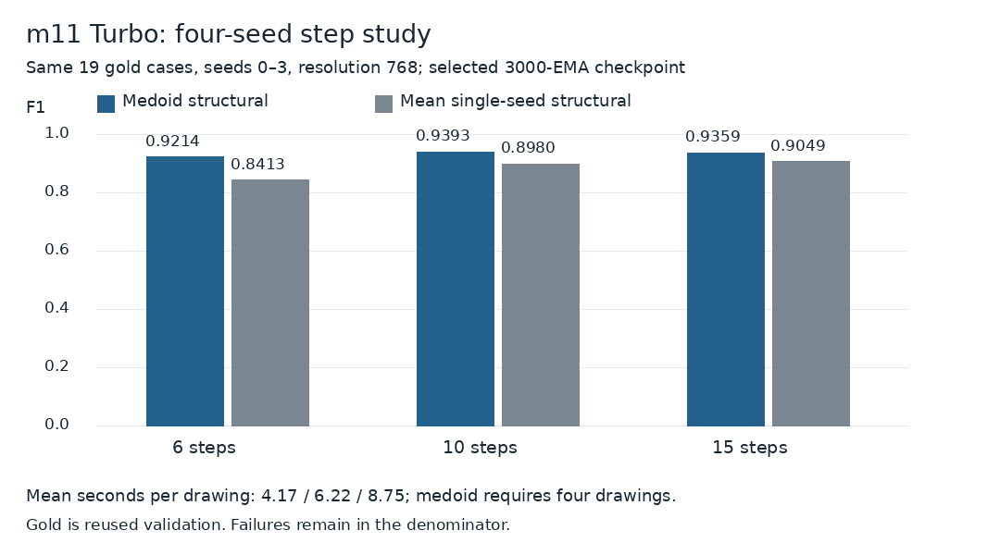
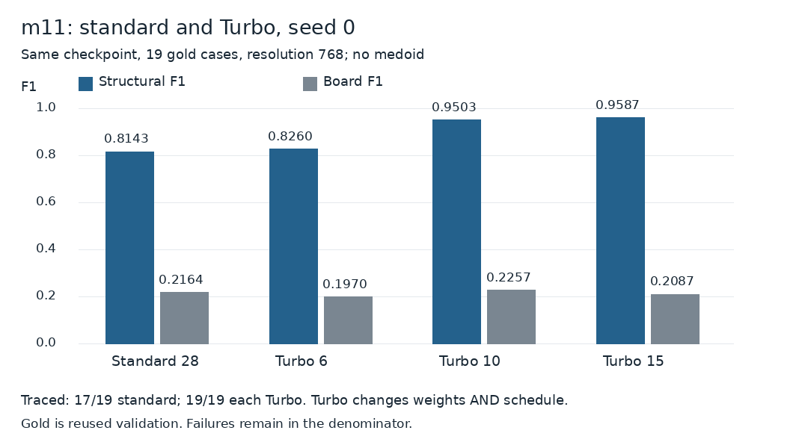

# m11 checkpoint and inference studies

## Checkpoint selection

The useful comparison is test selection, not the most flattering gold row. Full-precision numbers remain in the verified JSON.

Source S8: `archive/qwen21-m11-r64/selection.json`. Highest test four-seed medoid structural F1 selected 3000-EMA among 1430-EMA at resolution512, 2200-EMA at resolution512 and 3000-EMA at resolution768. Gold/holdout were reported, not the selection rule. Repeated test use makes test a development set.

Training: rank64, 3000 optimizer steps, accumulation8, learning rate 8e-5, training seed3; `512x2520+768x480`, phase cosine scheduling, phase peaks 1/0.5, warmup50, minimum learning-rate fraction0.05, EMA decay0.995, EMA reset at the phase boundary. Warm start: rank96 soup reduced to rank64 by SVD. m10 used rank96 and 1430 steps with another schedule/warm start. These variables are confounded.

m11 test/gold medoid structural F1: 0.9137/0.9141. Historical m10 reference: 0.9235/0.9225. Mean single-seed structural F1 is higher for m11 on test and gold; this does not imply a higher medoid score or a causal rank benefit. Selection aggregates include one untraced medoid on test for both references.

## Four-seed step study

The medoid needs four generations. A per-drawing time is not the complete interaction time.

Source S9: `archive/qwen21-m11-steps61015-gold/results.json` and `run-manifest.json`. Same 19 golds, seeds0–3, resolution768, selected m11 rank64 3000-EMA adapter plus Turbo, both at weight1.0. The archive calls the first adapter `m10` in this manifest, but its checkpoint path is explicitly m11 `ckpt-3000-ema/lora.safetensors`; this is a legacy adapter alias, not an m10 run.

Base: `Qwen/Qwen-Image-2.1`, revision `d26bb61231c349cf6b7896fa83353113880e1ba3`. Turbo: `Viggle/Qwen-Image-2.1-viggle-turbo`, revision `009a44a895ef85f7e643c80fdca9543795248867`. Runtime: Torch2.14.1+cu130, Diffusers0.41.0.dev0; BF16 base, FP32 adapter masters, L40S. These identify the archived runtime, not a new verified installation recipe.

Prompt, unchanged across arms:

> Redraw only the furniture carcass as an orthographic front elevation. Draw each structural board as a solid black bar at its thickness. Preserve stepped tops, partial shelves and dividers. Keep openings white, including compartments covered by opaque doors or drawer fronts. Keep shelves visible through glass. Omit legs, plinths, backs, worktops, fronts, handles, contents, perspective and shading.

Turbo uses the shipped scheduler configuration with `shift_terminal=None`. The actual sigma node lists are:

- 6: `1, .9375, .875, .75, .5, .25`
- 10: `1, .9791666667, .9583333333, .9375, .9166666667, .8958333333, .875, .75, .5, .25`
- 15: `1, .9886363636, .9772727273, .9659090909, .9545454545, .9431818182, .9318181818, .9204545455, .9090909091, .8977272727, .8863636364, .875, .75, .5, .25`

Full floating-point values are in [verified JSON](../results/m11-verified.json). The manifest records 228 completed generations with matching actual step counts. Means are recomputed from all 19 per-case rows. Medoid selection picks one traced candidate by pairwise agreement, without gold labels. It does not average images. All-case scores, selected seeds and compiled panel views are in [the gallery](m11-gallery.md).

Ten steps gives the highest medoid structural score in this small study. Board F1 drops with more steps. The mean single-seed score rises. This is a gold-only tradeoff, not a test-selected policy. The earlier checkpoint-selection execution reports a different six-step gold score; it is kept separate.

Timings are mean generation seconds per drawing over 76 generations per arm. A four-seed medoid needs four drawings, plus trace/selection/render time not counted here. They are not end-to-end latency measurements.

## Standard28 versus Turbo: seed 0 only

Source S10: `archive/qwen21-m11-standard28-gold/results.json` and `run-manifest.json`. Same m11 checkpoint, same sorted 19 cases, resolution768, seed0. Standard28 uses no Turbo adapter and the base default dynamic-shift schedule (`shift_terminal=.02`, base_shift=.5, max_shift=.9, exponential time shift). Turbo6/10/15 seed0 scores come from the step-study execution. No medoid is used.

Standard28 fails to trace `real-closed011` and `real-open024`. Both get zero; the headline averages all19. On the common17 traced cases, structural F1 is standard28 0.9101 and Turbo6 0.8448. This conditional subset is secondary and must not replace the headline. This compares configurations, not isolated causes: Turbo changes weights and schedule. It does not test Turbo28 or establish performance against a best base40 configuration.

## Publication checks

`build_figures.py` verifies means, run timing means, actual steps, case order and the existence of 19 selected compiled documents before it emits figures. Archive source SHA-256 values are recorded in the sanitized result file. The later comparison figures include third-party source photos, raw selected generated drawings and actual Fabivo renders. They have separate [reference-rights records](comparison-sources.md), not an annotation/software license. Raw labels and full private documents are not copied. This documentation release did not run new GPU inference or training. The [m11 weights are now published in a separate model repository](https://huggingface.co/Superpapotas1/fabivo-boards-image-lora-m11); they do not replace m10.
