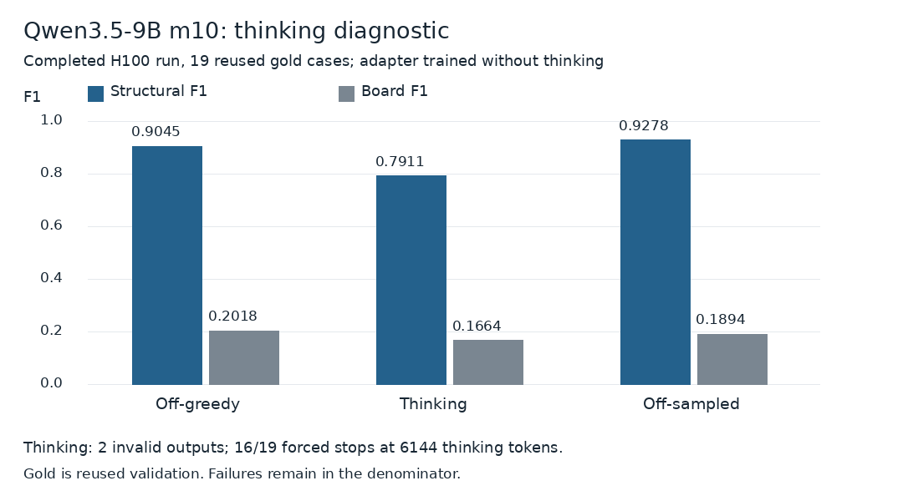

# Fabivo boards VLM 9B

A board-list LoRA for the Apache-2.0 Qwen3.5-9B base. The training loader used `unsloth/Qwen3.5-9B`, as recorded in `adapter_config.json`. This repository contains the m10 step-800 EMA adapter, rank 16. It continues m9 training. Base weights are not included.

## Why coordinates instead of pixels

The image route can draw a reasonable shelf that the raster reader cannot parse because of broken bars or doubled outlines. This VLM route removes that interface: it emits canonical board rectangles directly. The tradeoff is format failures and invented coordinates rather than raster failures. It does not recover calibrated dimensions. The target is front-facing carcass structure, not hardware, hidden backs or joints.

[Project explanation, actual photo-to-CAD examples and rejected experiments](https://github.com/Superpapotas/fabivo-boards). The examples there use the separate experimental m11 image model, not this VLM. AI tools assisted project code and documentation; base-model authorship is not claimed.

## Related image-pipeline comparison

The image route compares two GPT Image 2.5 edits with one direct m11 drawing. **These outputs are not from this VLM adapter.** Both drawings enter the same Fabivo reader. This is a saved visual comparison, not a controlled accuracy benchmark; prompts, resolution and budgets differ. The GPT console uses a saved rerun after an invalid provider response. CAD dimensions are defaults, not photo measurements.

[Three cases and protocol](../../docs/gpt-image-comparison.md) · [m11 image weights](https://huggingface.co/Superpapotas1/fabivo-boards-image-lora-m11) · [Saved gallery; no live inference](https://huggingface.co/spaces/Superpapotas1/fabivo-boards-demo)

## Results

| Adapter | Test structural F1 | Gold structural F1 |
|---|---:|---:|
| m9 step 600 | 0.7576 | 0.8646 |
| m9 step 1200 | 0.8333 | 0.9020 |
| m10 step 800 | 0.8668 | 0.8975 |
| m10 step 800 EMA, included here | 0.8656 | 0.9284 |

m9 test is mix9. m10 test is mix10. They are not identical tests. Step 800, not EMA, was selected by test structural F1. Gold is a reused 19-case diagnostic set, not unseen validation. The included historical EMA is not the test-selected checkpoint.

A completed H100 thinking test scored 0.9045 structural F1 and 0.2018 board F1 with thinking off and greedy decoding. Thinking scored 0.7911 and 0.1664, with two invalid outputs and sixteen of nineteen forced stops at the 6144-token thinking budget. Off-sampled scored 0.9278 and 0.1894. Thinking hurt this adapter. Training disabled thinking. Earlier two-T4 attempts failed with CUDA OOM; they are not the completed H100 test.

The plot reports the archive's `struct_f1`; its stricter `valid_struct_f1`, which rejects invalid-format answers, is 0.6941 for thinking. All 19 cases remain in both means. [Full-precision aggregates](../../results/thinking-verified.json) and [experiment notes](../../docs/experiments.md).

## Inference

Install current `torch`, `transformers`, `accelerate`, `peft` and `pillow`. Authenticate with the normal Hugging Face client. Run `python infer.py authorized-photo.jpg`. The example disables thinking and uses greedy decoding. GPU execution of this new example was not run for this release. The prompt is copied from the training script.

Output begins with `box W H`. The longer front dimension is 1000. Each following row is `h x0 y0 x1 y1` or `v x0 y0 x1 y1`. The origin is upper left. These are board-face rectangles, not measured cutting dimensions.

## License and limits

Adapter weights and example code: Apache-2.0. Copyright 2026 Superpapotas. Qwen3.5-9B's base card and license were rechecked. Do not apply this license to the separately released image-model adapter. The raw original-photo training dataset is not distributed. Documentation comparison figures may contain third-party reference photos, all original rights retained and excluded from Apache-2.0/CC BY grants. [Sources and missing credits](../../docs/comparison-sources.md). Hidden construction is uncertain. Reused gold and test selection limit generalization claims. Do not use an unreviewed board list as a construction plan. Private sampler/data inputs prevent complete end-to-end reproduction. The separately documented experimental m11 image study does not change these VLM weights.
